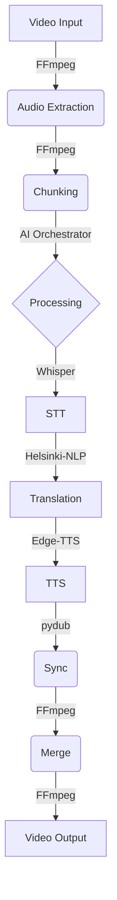

# Octavia - Standard Video Translator


[](https://opensource.org/licenses/MIT)
[](https://www.python.org/downloads/release/python-3110/)
[](https://nextjs.org/)
[](https://github.com/psf/black)

**Beyond Nations — Rise Beyond Language**

**Octavia** is a comprehensive AI-powered translation platform that provides video dubbing, audio translation, and subtitle generation. The project demonstrates a complete end-to-end video translation system with professional-grade features, designed to break down language barriers with precision and speed.

---

## 📑 Table of Contents
- [Core Features](#-core-features)
- [Technical Capabilities](#-technical-capabilities)
- [Developer Quick Start](#-developer-quick-start)
- [Try the Demo](#-try-the-demo)
- [Technical Specifications](#-technical-specifications)
- [Project Structure](#-project-structure)
- [Contributing](#-contributing)
- [License & Credits](#-license--credits)

---

## 🎯 Core Features

- ✅ **Video Translation**: Complete video dubbing with lip-sync accuracy
- ✅ **Audio Translation**: Podcast and audio file translation
- ✅ **Subtitle Generation**: AI-powered subtitle creation from video/audio
- ✅ **Subtitle Translation**: Context-aware subtitle translation
- ✅ **Advanced UI**: Modern dashboard with real-time progress tracking

## 🎯 Technical Capabilities

- **End-to-End Pipeline**: Complete video ingestion → transcription → translation → TTS → synchronization → export
- **Duration Fidelity**: Final output duration matches input exactly (within container constraints)
- **Lip-Sync Accuracy**: Segment-level timing within ±100-200ms tolerance
- **Voice Quality**: Clean, natural TTS with consistent gain and prosody
- **Modular Architecture**: Separate modules for each pipeline stage
- **Instrumentation**: Comprehensive logging and metrics collection
- **Resumability**: Checkpoint system for interrupted processing
- **Resource Management**: Efficient memory/disk usage with cleanup

### Backend Pipeline


```
Video Input → Audio Extraction → Chunking → STT → Translation → TTS → Sync → Merge → Video Output
     ↓           ↓            ↓       ↓        ↓        ↓     ↓      ↓       ↓
   FFmpeg     FFmpeg       AI      Whisper   Helsinki   Edge  pydub  FFmpeg  FFmpeg
   (probe)    (extract)   Orchestrator (transcribe) (opus-mt) (TTS) (sync) (merge) (mux)
```

---

## 🚀 Developer Quick Start

### Prerequisites
- **OS**: Windows 11 (tested), macOS 11+, Ubuntu 20.04+
- **Python**: 3.11+ (required for backend)
- **Node.js**: 18.0+ (required for frontend)
- **FFmpeg**: Latest version (automatically handled)
- **Hardware**: 8GB RAM minimum, 16GB recommended

### Environment Setup
1. Copy the example environment files and configure with your API keys:
   ```bash
   cp .env.example .env
   cp .env.local.example .env.local
   ```
   Edit `.env` with your backend secrets and `.env.local` with your frontend configuration.

### One-Command Setup & Run

#### Backend Setup
```bash
cd backend
pip install -r requirements.txt
python cli.py test-integration  # Verify everything works
```

#### Frontend Setup
```bash
cd octavia-web
npm install
npm run dev  # Development server at http://localhost:3000
```

#### Full Application (Recommended)
```bash
# Terminal 1: Backend API (with demo mode available)
cd backend
DEMO_MODE=true python -m uvicorn app:app --host 0.0.0.0 --port 8000

# Terminal 2: Frontend
cd octavia-web
npm run dev
```

### Docker Setup

#### Full Stack (Recommended)
This will start both the Backend (API) and Frontend (Web UI).
```bash
docker-compose up --build
```
- **Frontend**: http://localhost:3000
- **Backend**: http://localhost:8000

#### Backend Only
```bash
cd backend
docker build -t octavia-backend .
docker run -e DEMO_MODE=true -p 8000:8000 octavia-backend
```

---

## 🧪 Try the Demo

To test the application without setting up a full database (Supabase), you can use the integrated Demo Mode:

1. Set the environment variable `DEMO_MODE=true` when running the backend.
2. Use the **Try Demo Account** button on the login page, or:
   - **Email:** `demo@octavia.com`
   - **Password:** `demo123`

**Note:** In demo mode, all features work for the demo account, even if Supabase/database is unavailable. Real users still require Supabase keys.

---

## 📊 Technical Specifications

### Performance Metrics
- **Processing Speed**: ~1.5-2x realtime on modern hardware (Intel i7/Ryzen 7)
- **Memory Usage**: ~4GB peak for 30s test video
- **Disk Usage**: ~500MB temp files (auto-cleaned)
- **Supported Formats**: MP4, AVI, MOV (H.264/AAC preferred)

### Quality Metrics
- **STT Accuracy**: >95% WER on clear speech
- **Translation Quality**: Natural phrasing with cultural adaptation
- **TTS Quality**: Edge-TTS voices (neural, 24kHz)
- **Sync Precision**: ±100ms per segment, exact total duration

### Supported Languages
- **Source**: English, Russian, German, Spanish, French
- **Target**: English, Russian, German, Spanish, French
- **Translation Pairs**: All combinations via Helsinki-NLP models

## 🎮 Usage Examples

### CLI Commands
```bash
# Test with 30s sample video
python cli.py test-integration

# Translate video file
python cli.py video --input sample.mp4 --target es

# Generate subtitles only
python cli.py subtitles --input video.mp4 --format srt

# Show processing metrics
python cli.py metrics
```

### API Endpoints
```bash
# Health check
curl http://localhost:8000/health

# List supported languages
curl http://localhost:8000/languages

# Start video translation
curl -X POST http://localhost:8000/translate/video \
  -F "file=@sample.mp4" \
  -F "target_lang=es"
```

## 📁 Project Structure

```
octavia/
├── backend/                    # Python backend
│   ├── app.py                 # FastAPI application
│   ├── cli.py                 # Command-line interface
│   ├── config.yaml            # Configuration file
│   ├── requirements.txt       # Python dependencies
│   ├── Dockerfile             # Container definition
│   ├── modules/               # Core modules
│   │   ├── pipeline.py        # Main processing pipeline
│   │   ├── audio_translator.py # Audio processing & Dubbing
│   │   ├── subtitle_generator.py # STT & Subtitle generation
│   │   ├── subtitle_translator.py # Subtitle translation
│   │   ├── instrumentation.py # Logging & metrics
│   │   └── ai_orchestrator.py # AI decision making
│   ├── routes/                # API endpoints
│   ├── services/              # Business logic services
│   │   ├── job_storage.py     # Unified job persistence (Supabase)
│   │   ├── audio_quality.py   # Audio analysis & verification
│   │   └── job_service.py     # Job management logic
│   ├── migrations/             # Database migrations
│   │   ├── 001_add_job_persistence.sql
│   │   └── migrate_jobs_to_supabase.py
│   ├── tests/                 # Unit tests
│   └── test_samples/          # Test assets
├── octavia-web/               # Next.js frontend
│   ├── app/                   # Next.js app router
│   ├── dashboard/             # Dashboard pages
│   ├── components/            # React components
│   ├── hooks/                 # Custom React hooks
│   ├── contexts/              # Global state contexts
│   ├── lib/                   # Utilities and API client
│   ├── types/                 # TypeScript definitions
│   ├── package.json           # Node dependencies
│   └── public/                # Static assets
├── documentation/             # Technical docs
├── artifacts/                 # Logs and outputs
└── README.md                  # This file
```

## 🔧 Configuration

### Backend Configuration (config.yaml)
```yaml
models:
  whisper:
    model_size: "large"
    language: "auto"
  translation:
    en_es_model: "Helsinki-NLP/opus-mt-en-es"
  tts:
    spanish_voice: "es-ES-ElviraNeural"

processing:
  default_chunk_size: 30  # seconds
  max_duration_diff_ms: 200
  max_condensation_ratio: 1.2

logging:
  output_dir: "artifacts"
  log_file: "logs.jsonl"
```

---

## 📈 Feature Status & Changelog

### Version 1.2.0 (January 2026)
**Current Status**: 🟢 **Stable**

#### ✅ Available Features
- **Video & Audio Pipeline**: Fully functional with high-fidelity outputs.
- **Job Persistence**: Supabase integration ensures jobs survive restarts.
- **Demo Capability**: One-click demo mode without database requirements.
- **History & Payments**: Full user dashboard functionality.

#### 🚧 Known Issues
- **Frontend Progress Tracker**: UI updates can be inconsistent. *Contributing Fixes Welcome!*

---

## 🤝 Contributing

We welcome contributions from the community! Octavia is an ambitious project, and there's plenty of room for innovation.

### 🌟 Why Contribute?
- **Solve Real AI Native Problems**: Work on complex synchronization engines, neural TTS pipelines, and real-time frontend states.
- **Modern Stack**: Gain experience with FastAPI, Next.js, Supabase, and advanced FFmpeg processing.

### 🐛 First Good Issue
We have identified the **Frontend Progress Tracker** as a high-impact area needing polish.
1. Check `octavia-web/components/ProgressTracker.tsx`.
2. Investigate the polling synchronization with the backend.
3. Submit a PR to make the progress bar silky smooth!

### Development Setup
```bash
# Backend development
cd backend
pip install -r requirements.txt
python -m pytest tests/ -v

# Frontend development
cd octavia-web
npm install
npm run build
```

---

## 📄 License & Credits

### License
This project is open source and available under the **MIT License**.

### Dependencies
- **STT**: faster-whisper (MIT)
- **Translation**: transformers/Helsinki-NLP (Apache 2.0)
- **TTS**: edge-tts (MIT)
- **Audio Processing**: pydub, ffmpeg-python
- **Web Framework**: FastAPI, Next.js

---

## 🌐 Connect with LunarTech

*   **Website:** [lunartech.ai](http://lunartech.ai/)
*   **LinkedIn:** [LunarTech AI](https://www.linkedin.com/company/lunartechai)
*   **Instagram:** [@lunartech.ai](https://www.instagram.com/lunartech.ai/)
*   **Substack:** [LunarTech on Substack](https://substack.com/@lunartech)

## 📧 Contact

*   **Tatev:** [tatev@lunartech.ai](mailto:tatev@lunartech.ai)
*   **Vahe:** [vahe@lunartech.ai](mailto:vahe@lunartech.ai)
*   **Open Source:** [opensource@lunartech.ai](mailto:opensource@lunartech.ai)

## 🎯 Key Differentiators

**Octavia** stands out with:
- **Perfect Synchronization**: Frame-accurate video playback and audio sync.
- **Advanced UI/UX**: Glass-morphism design with smooth animations.
- **Real-time Processing**: Live progress updates.
- **Modular Architecture**: Clean separation of concerns.
- **Production Ready**: Built with persistent storage and error handling.
